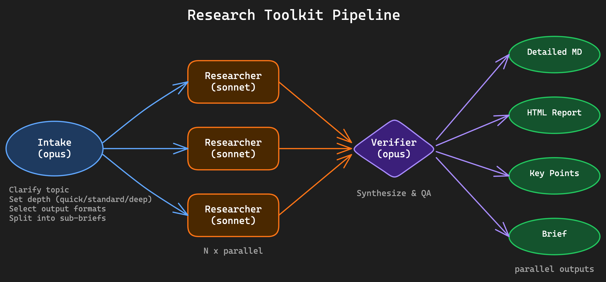

# research-toolkit

A Claude Code plugin for structured, multi-agent web research with parallel execution, source verification, and formatted output generation.

## Installation

**As a plugin (recommended):**
```bash
claude --plugin-dir /path/to/research-toolkit
```

**Or clone and use directly:**
```bash
git clone https://github.com/vmeyer/research-toolkit.git
cd research_template
claude
```

Then run `/research-toolkit:research-and-summarize` (plugin) or `/research-and-summarize` (standalone).

## What it does

You give it a topic. It clarifies what you need, splits the research into parallel tracks, searches the web with a triangulation strategy, verifies and synthesizes the results, and produces formatted reports — all autonomously after the initial intake.

### Pipeline

```
Intake (opus) → N × Researcher (sonnet, parallel) → Verifier (opus) → Formatter(s) (parallel)
```



**Single interaction point.** The intake agent asks clarifying questions one at a time (max 5). After that, the entire pipeline runs without interruption.

### Agents

| Agent | Model | Role |
|-------|-------|------|
| intake-1 | opus | Clarifies topic iteratively, determines depth/formats/language, splits into 2-4 sub-briefs |
| researcher-1 (×N) | sonnet | Executes one sub-brief each using triangulation search strategy |
| verifier-1 | opus | Merges results, synthesizes themes, verifies quality, fills gaps |
| detailed-1 | sonnet | Comprehensive Markdown report |
| html-report-1 | opus | Styled HTML report from template |
| keypoints-1 | sonnet | Structured key points for skill creation |
| brief-1 | sonnet | Executive summary (2-3 paragraphs) |

### Research strategy: Triangulation

Three depth levels, configurable during intake:

- **quick** — 2 query variations, ~5 sources, fast overview
- **standard** (default) — 3-4 query variations, 8-12 sources, 3+ source types, counter-argument search, citation chain following
- **deep** — All of standard plus academic sources, expert tracking, 15+ sources

Every key claim is backed by at least 2 independent sources. Full source traceability from researcher through verifier to final output.

### Output

Reports are saved to `./research/<topic-slug>/` with auto-versioning:

```
./research/webassembly-enterprise-adoption/
  detailed-report-v1.md     # Full report with citations
  report-v1.html            # Styled HTML (from template)
  key-points-v1.md          # Structured for skill creation
  brief-summary-v1.md       # Executive summary
```

All files include YAML frontmatter with topic, date, version, language, sources count, and completeness score.

## Dashboard

After running multiple research sessions, generate an overview page:

```
/research-toolkit:research-dashboard
```

This reads all HTML reports from `./research/` and creates a static `index.html` with links, scores, and summary excerpts.

## Skills

| Skill | Description |
|-------|-------------|
| `research-and-summarize` | Full research pipeline |
| `research-dashboard` | Aggregate HTML reports into dashboard |

## Project structure

```
research-toolkit/
├── .claude-plugin/
│   └── plugin.json              # Plugin manifest
├── agents/                      # Agent definitions (plugin)
│   ├── intake-1.md
│   ├── researcher-1.md
│   ├── verifier-1.md
│   ├── detailed-1.md
│   ├── html-report-1.md
│   ├── keypoints-1.md
│   └── brief-1.md
├── skills/                      # Skills (plugin)
│   ├── research-and-summarize/
│   └── research-dashboard/
├── commands/                    # Slash commands (plugin)
├── templates/
│   └── report.html              # HTML report template
├── .claude/                     # Standalone config (for direct use)
│   ├── agents/
│   └── commands/
├── .gemini/skills/              # Gemini CLI support
└── .github/prompts/             # GitHub Copilot support
```

## Cross-platform support

| Platform | How to use |
|----------|------------|
| Claude Code (plugin) | `claude --plugin-dir .` → `/research-toolkit:research-and-summarize` |
| Claude Code (standalone) | Clone repo → `/research-and-summarize` |
| Gemini CLI | Clone repo, skills auto-detected |
| GitHub Copilot | Clone repo, prompts auto-detected |

## License

MIT
